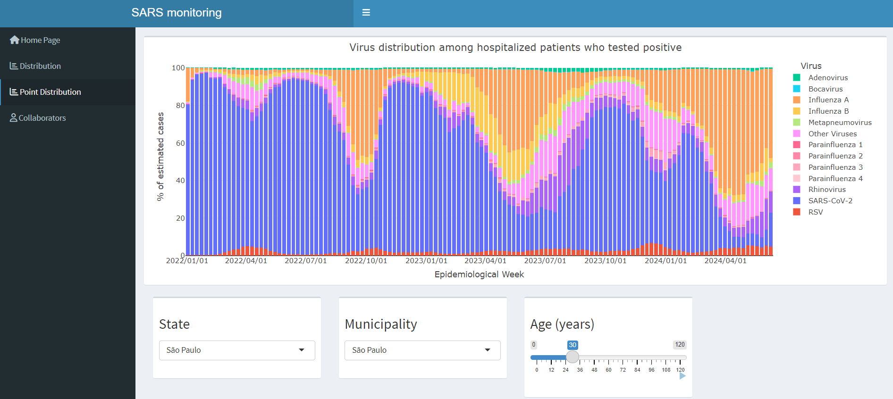

# PySRAG

This Python package provides tools for analyzing and processing data related to Severe Acute Respiratory Syndrome (SARS) and other respiratory viruses. It includes functions for data preprocessing, feature engineering, and training Gradient Boosting Models (GBMs) for binary or multiclass classification.

## Getting Started

These instructions will help you get started with using the PySRAG package.

### Prerequisites

Before you begin, ensure you have met the following requirements:

- Python 3 installed
- Required Python packages (you can install them using `pip`):
  - `pandas==1.5.3`
  - `numpy==1.23.5`
  - `scikit-learn==1.2.2`
  - `lightgbm==4.0.0`

### Installation

You can install the PySRAG package using `pip`:

```python
pip install PySRAG
```

### Usage

Here's an example of how to use the SRAG package:

```python
from pysrag.data import SRAG
from pysrag.model import GBMTrainer

# from https://opendatasus.saude.gov.br/dataset/srag-2021-a-2023
filepath = 'https://s3.sa-east-1.amazonaws.com/ckan.saude.gov.br/SRAG/2023/INFLUD23-16-10-2023.csv' 

# Initialize the SRAG class
srag = SRAG(filepath)

# Generate training data
X, y = srag.generate_training_data(lag=None, objective='multiclass')

# Train a Gradient Boosting Model
trainer = GBMTrainer(objective='multiclass', eval_metric='multi_logloss')
trainer.fit(X, y)

# Get Prevalences
trainer.model.predict_proba(X)
array([[0.36010109, 0.00913779, 0.01018454, 0.0413374 , 0.57923918],
       [0.26766377, 0.16900332, 0.13882407, 0.10029527, 0.32421357],
       [0.01113844, 0.0879723 , 0.00920112, 0.87940126, 0.01228688],
       ...,
       [0.02176705, 0.03438226, 0.01555221, 0.11300813, 0.81529035],
       [0.02176705, 0.03438226, 0.01555221, 0.11300813, 0.81529035],
       [0.08954213, 0.17430267, 0.041657  , 0.66829007, 0.02620812]])
```

<!---
For more detailed information and examples, please refer to the package documentation.

## Documentation

You can find the full documentation for the SRAG package in the [docs](docs/) directory.

## Contributing

If you would like to contribute to this project, please follow these steps:

1. Fork the repository.
2. Create a new branch for your feature or bug fix: `git checkout -b feature/your-feature-name`
3. Commit your changes: `git commit -m "Add new feature"`
4. Push to your branch: `git push origin feature/your-feature-name`
5. Create a pull request.

## License

This project is licensed under the MIT License - see the [LICENSE](LICENSE) file for details.

## Acknowledgments

- Special thanks to the contributors and maintainers of the SRAG Analysis package.

Happy coding!
-->

## Web Application

The PySRAG package includes a web application that allows users to interactively explore data related to Severe Acute Respiratory Syndrome (SARS) in Brazil. This web-based interface provides a practical way for users to visualize data without needing deep technical knowledge of Python or the underlying code.

### Accessing the Web Application

To access the web application, visit:

[PySRAG Web App](https://joaoflavio.shinyapps.io/Prevalencia_SRAG/)

This link will take you to a hosted version of our application, equipped with preloaded data and features for easy exploration.

[]([URL_do_link](https://joaoflavio.shinyapps.io/Prevalencia_SRAG/))

### Features

The web application offers the following features:

- **Data Visualization**: Interactive graphs display processed data, giving insights into the distribution of respiratory viruses.
- **Data Filtering**: Users can apply filters based on city and patient age to narrow down the data and focus on specific demographics or regions.

### How to Use

1. **Navigate to the Dashboard**: Start on the dashboard, which provides an overview of the visualizations.
2. **Apply Filters**: Use the filtering options to select specific cities or age ranges to view customized data visualizations.
4. **Explore Visualizations**: Interact with the visual data representations to gain deeper insights into the trends and patterns.

### Support

If you encounter any issues while using the web application or have suggestions for improvements, please submit an issue on our [GitHub page](https://github.com/joao-1988/PySRAG/issues).

This web application is designed to make the data analysis capabilities of the PySRAG package accessible to both technical and non-technical users, enhancing understanding and facilitating research on respiratory viruses.
